<div align="center">

# 🍹 Drinks Menu App

**A beautifully crafted Flutter application for browsing and ordering drinks**


</div>

---

## 📱 Screenshots

<table>
  <tr>
    <td align="center">
      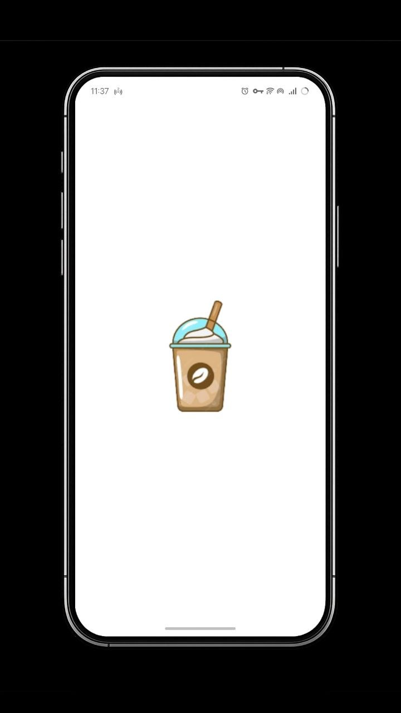
      <br /><b>Splash Screen</b>
    </td>
    <td align="center">
      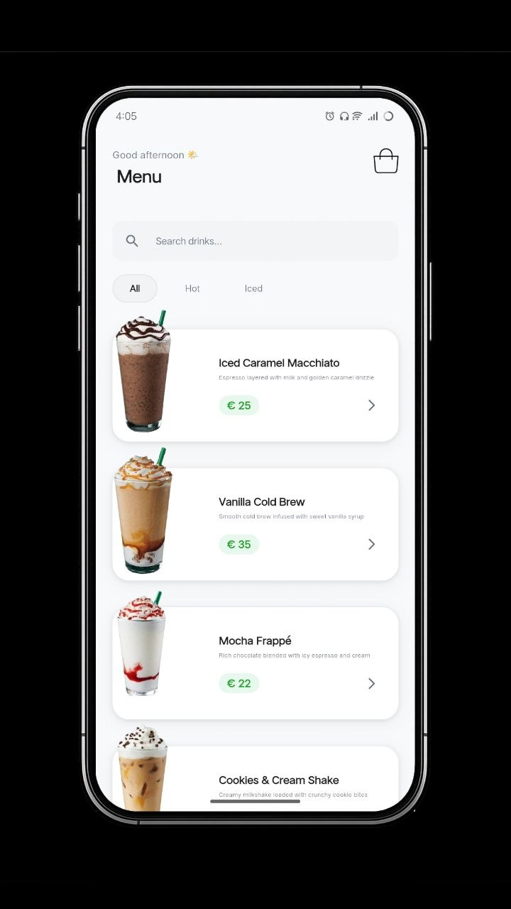
      <br /><b>Home – All Products</b>
    </td>
    <td align="center">
      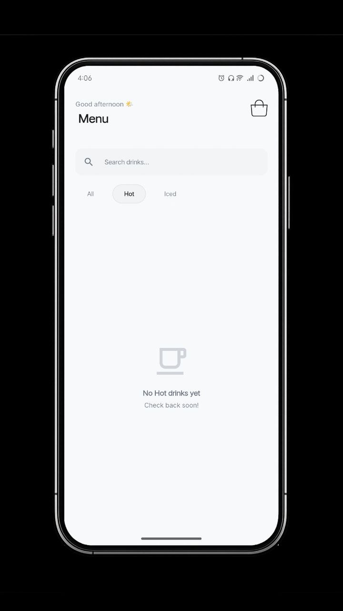
      <br /><b>Home – Hot Drinks Filter</b>
    </td>
  </tr>
  <tr>
    <td align="center">
      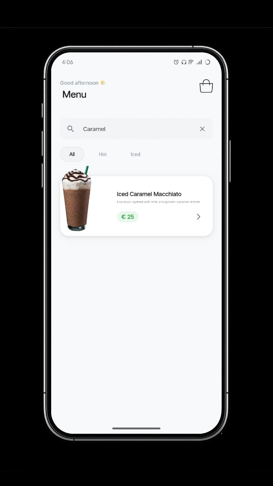
      <br /><b>Home – Filter with Search</b>
    </td>
    <td align="center">
      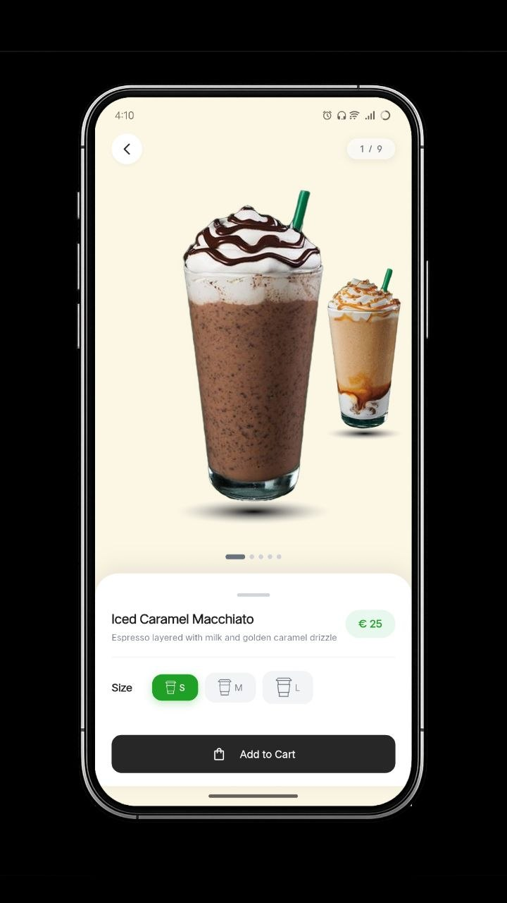
      <br /><b>Product Details</b>
    </td>
    <td align="center">
      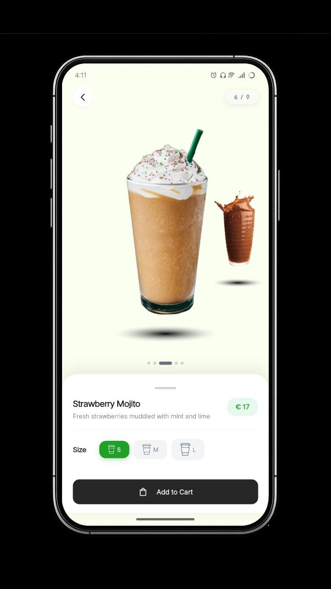
      <br /><b>Product Details – Size</b>
    </td>
  </tr>
  <tr>
    <td align="center">
      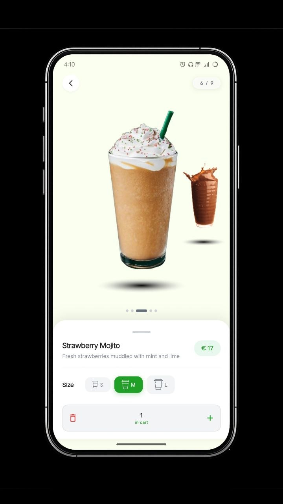
      <br /><b>Product Details – Swipe</b>
    </td>
    <td align="center">
      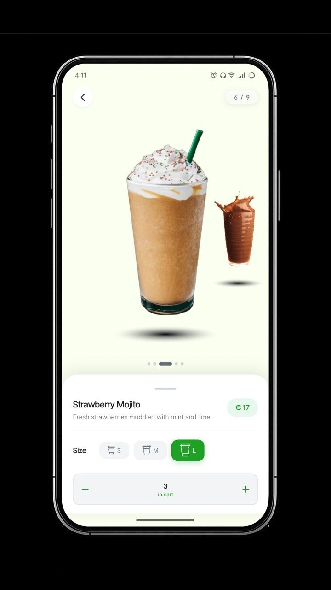
      <br /><b>Product Details – Add to Cart</b>
    </td>
    <td align="center">
      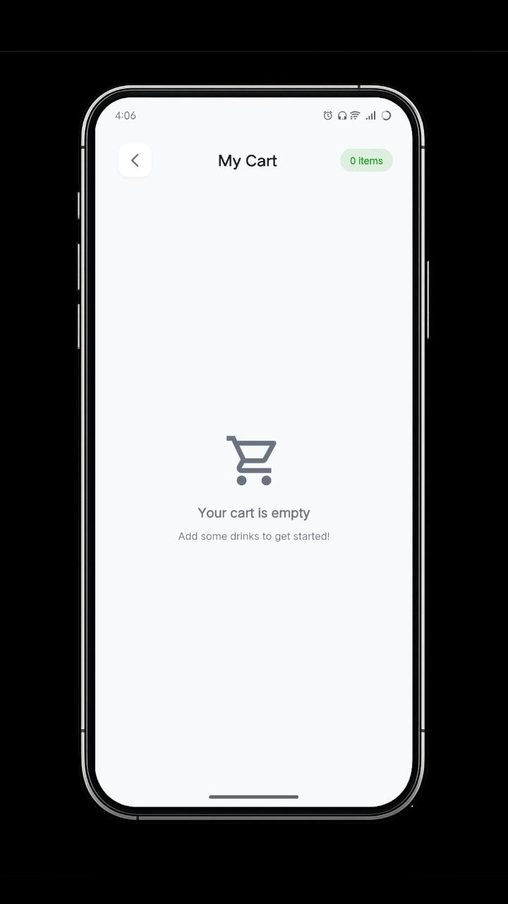
      <br /><b>Cart – Empty State</b>
    </td>
  </tr>
  <tr>
    <td align="center">
      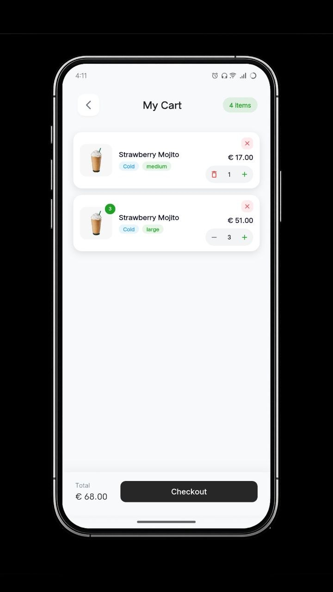
      <br /><b>Cart</b>
    </td>
    <td align="center">
      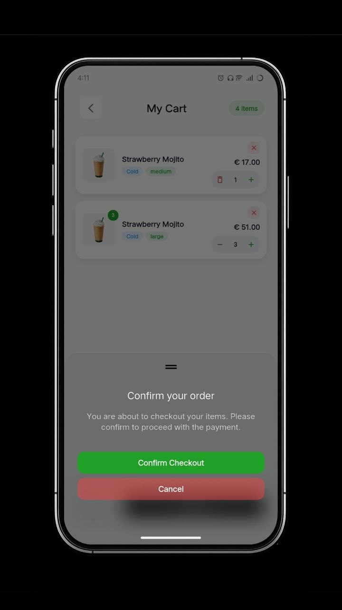
      <br /><b>Cart – Checkout</b>
    </td>
    <td></td>
  </tr>
</table>

---

## ✨ Features

- 🏠 **Home Screen** — Browse the full drinks catalog with a clean, card-based layout
- 🔍 **Search & Filter** — Real-time search combined with category filters (All, Hot, Cold, …)
- 📖 **Product Details** — Swipeable drink gallery with animated background tint transitions
- 🛒 **Cart Management** — Add items, choose size & quantity, view order summary
- 💳 **Checkout Flow** — Smooth checkout screen with order total breakdown
- 📱 **Responsive Design** — Adapts to all screen sizes using a responsive extension system
- 🎨 **Design System** — Consistent tokens for colors, spacing, shadows, and typography

---

## 🏗️ Architecture & Project Structure

```
lib/
├── core/
│   ├── themes/
│   │   └── colors.dart          # AppColors – brand & semantic palette
│   └── utils/
│       ├── app_spacing.dart     # AppSpacing – 4-pt grid + radius tokens
│       ├── app_text_style.dart  # AppTextStyles – typography scale
│       ├── app_shadows.dart     # AppShadows – elevation presets
│       └── context_extensions.dart  # Responsive helpers via BuildContext
├── features/
│   ├── Home/
│   │   ├── Data/
│   │   │   └── item_model.dart  # ItemModel – static drinks catalog
│   │   └── Presentation/
│   │       └── views/
│   │           └── home_view.dart
│   ├── ItemDetails/
│   │   └── Presentation/
│   │       ├── provider/
│   │       │   └── size_and_qty_provider.dart
│   │       └── views/
│   │           ├── item_details_view.dart
│   │           ├── item_details_view_body.dart
│   │           └── widgets/
│   │               ├── drink.dart
│   │               ├── drinks_dots.dart
│   │               ├── info_panel.dart
│   │               └── top_bar.dart
│   └── Cart/
│       └── Presentation/
│           └── views/
│               └── cart_view.dart
└── main.dart
```

The app follows a **feature-first** folder structure with a clear separation between **Data**, **Domain**, and **Presentation** layers inside each feature.

---

## 📄 License

This project is licensed under the MIT License — see the [LICENSE](LICENSE) file for details.

---

<div align="center">
  Made with ❤️ and Flutter
</div>
